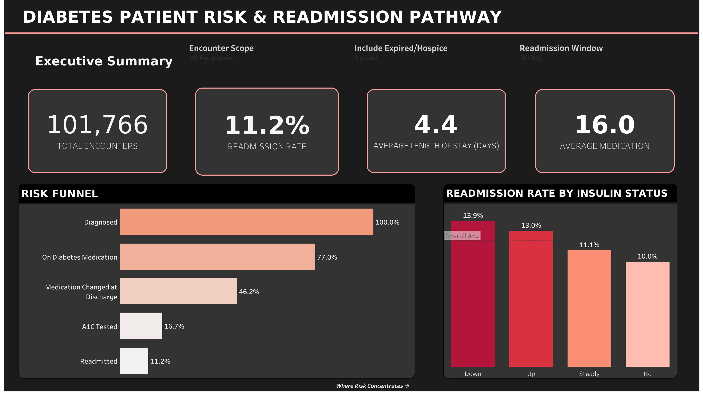
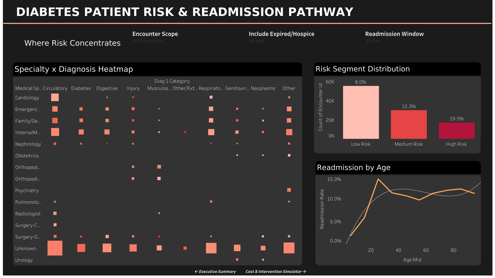
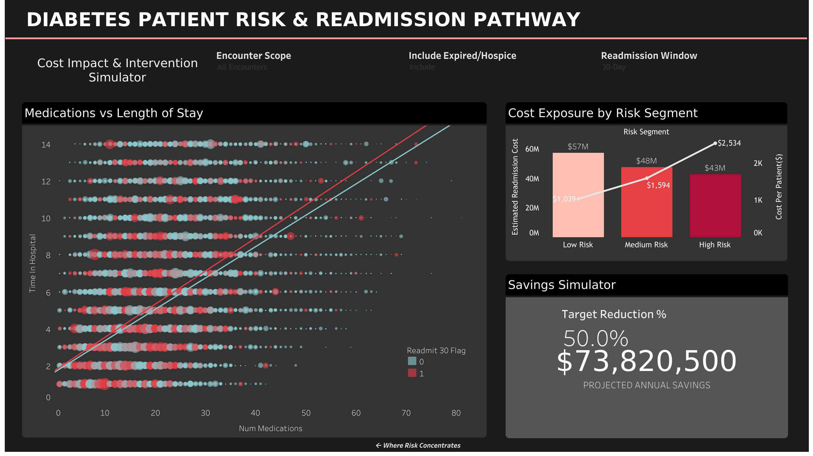

# Diabetes Patient Risk & Readmission Analytics Dashboard

A 3-page interactive Tableau dashboard built on real hospital encounter data, analyzing where diabetic patients fall through the cracks of the care system — and what it costs when they do.

---

## Why I Built This

Most student analytics projects in pharma/healthcare stop at "here's a chart of drug sales." This one goes deeper.

Readmission within 30 days of discharge is one of the most expensive, preventable problems in healthcare — and for diabetic patients specifically, it's often a signal that something went wrong at discharge: the wrong medication decision, a missed A1C test, or no follow-up plan.

I wanted to build something that actually resembles — not just a dashboard, but a decision tool that ties clinical patterns to commercial cost and intervention ROI.

---

## Live Dashboard

🔗 **[View on Tableau Public](https://public.tableau.com/views/DiabetesPatientRiskReadmissionAnalytics/ExecutiveSummary?:language=en-US&:sid=&:redirect=auth&:display_count=n&:origin=viz_share_link)**

---

## Dashboard Preview

### Page 1 — Executive Summary
> KPI tiles + care pathway funnel + readmission by insulin status


---

### Page 2 — Where Risk Concentrates
> Specialty × Diagnosis heatmap + readmission trend by age + risk segment distribution



---

### Page 3 — Cost Impact & Intervention Simulator
> Dual-axis cost exposure chart + medications vs LOS scatter + interactive savings simulator



---

## The Data

**Dataset**: [UCI ML Repository — Diabetes 130-US Hospitals (1999–2008)](https://archive.ics.uci.edu/dataset/296/diabetes+130-us+hospitals+for+years+1999-2008)

This is a real, peer-reviewed dataset representing 10 years of clinical care across 130 US hospitals. Each row is a hospital encounter for a patient diagnosed with diabetes who underwent lab tests and received medications during admission.

| Attribute | Detail |
|---|---|
| Rows | 101,766 encounters |
| Columns | 50 original + 10 engineered |
| Patients | 71,518 unique patients |
| Period | 1999–2008 |
| Source | UCI ML Repository (publicly available) |

### Key fields used
- **Demographics**: race, gender, age (binned)
- **Admission info**: admission type, discharge disposition, admission source (decoded from `IDS_mapping.csv`)
- **Clinical**: time in hospital, number of lab procedures, number of diagnoses, primary diagnosis (ICD-9)
- **Medications**: metformin, insulin, and 21 other diabetes drug columns
- **Lab results**: A1C result, max glucose serum
- **Prior utilization**: number of inpatient/emergency/outpatient visits in prior year
- **Outcome**: readmitted (`NO` / `<30` / `>30`)

---

## Data Cleaning

Raw data had several real-world quality issues that needed deliberate handling — not just a `dropna()` and move on.

### Issues found and how I handled them

| Issue | Approach |
|---|---|
| `weight` column 96.9% missing | Dropped entirely — not usable |
| `?` placeholder for missing values in 5 columns | Recoded to `Unknown` (kept as a valid category, not null) |
| Three coded ID columns (admission type, discharge, source) | Decoded by merging with `IDS_mapping.csv` lookup tables |
| Literal text `"NULL"` in mapping file | Forced `keep_default_na=False` to prevent pandas treating it as a real null — a subtle but real gotcha |
| 2,423 deceased/hospice encounters | Flagged (not deleted) — readmission is meaningless for these patients but deleting loses information |
| 101,766 rows but only 71,518 unique patients | Added `first_encounter_flag` — same approach as the original published study, avoids overweighting frequent flyers |
| 23 individual drug columns | Kept `metformin` and `insulin` granular; consolidated the other 21 into `other_diabetes_med_flag` and `diabetes_med_count` |
| ICD-9 diagnosis codes (raw) | Grouped into readable categories (Circulatory, Diabetes, Respiratory etc.) using standard published buckets |
| Age as text bins (`[60-70)`) | Added `age_mid` numeric midpoint column for correct chart sorting and trend line compatibility |

### Cleaned dataset adds these engineered columns
```
admission_type_desc     — decoded from IDS_mapping
discharge_desc          — decoded from IDS_mapping
admission_source_desc   — decoded from IDS_mapping
expired_or_hospice_flag — 1 if discharged to hospice/expired
readmit_30_flag         — binary: 1 if readmitted within 30 days
readmit_any_flag        — binary: 1 if readmitted at all
age_mid                 — numeric midpoint of age bin
first_encounter_flag    — 1 if first encounter for this patient
diabetes_med_count      — count of active diabetes medications
other_diabetes_med_flag — 1 if any non-insulin/metformin drug active
diag_1_category         — ICD-9 primary diagnosis grouped into readable buckets
```

---

## Dashboard Pages Explained

### Page 1 — Executive Summary

Four KPI tiles at a glance, then two charts that tell the core story:

**Risk Funnel** — shows the care pathway from diagnosis through to 30-day readmission, with each stage as a percentage of the original cohort:
```
Diagnosed (100%) → On Diabetes Med (77%) → Med Changed at Discharge (46.2%) 
→ A1C Tested (16.7%) → Readmitted within 30 Days (11.2%)
```
The sharpest drop is between "On Diabetes Med" and "Med Changed at Discharge" — over half the patients had no medication adjustment at the point of discharge. That's the care gap.

**Readmission by Insulin Status** — patients whose insulin was *reduced* at discharge ("Down") have the highest readmission rate (13.9%), even higher than those whose dose went *up* (13.0%). Counterintuitive finding, but it likely reflects premature dose reduction before a patient's glycemic control was actually stable.

---

### Page 2 — Where Risk Concentrates

**Specialty × Diagnosis Heatmap** — 15 specialties × 10 diagnosis categories, colored by readmission rate, sized by encounter volume. The "Unknown" specialty row (representing the 49% of encounters with no recorded treating specialty) consistently shows large squares — a data completeness gap worth flagging to hospital data governance teams. Cells with fewer than 100 encounters are filtered out to suppress statistically unreliable rates.

**Readmission by Age** — line chart with trend line showing how readmission rate varies across age groups. Uses the `age_mid` numeric field rather than the raw text bin for correct axis ordering and to enable the regression trend line (Tableau requires a continuous numeric axis for this).

**Risk Segment Distribution** — validated risk score built from 5 factors with actual predictive power (verified against real readmission rates before including):

| Factor | Points | Rationale |
|---|---|---|
| Prior inpatient visits ≥2 | 3 pts | Strongest predictor — 21.4% readmission rate |
| Prior emergency visits ≥1 | 2 pts | 16.6% readmission rate |
| Prior inpatient visits = 1 | 1 pt | Dose-response from 0 visits |
| Prior outpatient visits ≥1 | 1 pt | 13.6% readmission rate |
| High comorbidity (diagnoses ≥8) | 1 pt | 12.3% readmission rate |
| Long stay ≥7 days | 1 pt | 13.2% readmission rate |

**Two factors I initially included but removed after validation**: A1C result and diabetes medication count were both *negatively* associated with readmission in this data — patients with worse labs actually readmitted less, likely because they received more aggressive in-hospital management before discharge. Including them would have made the score less accurate, not more.

Final risk segments:
- **Low Risk** (score 0–1): 8.0% readmission rate, 54,967 patients
- **Medium Risk** (score 2–3): 12.3% readmission rate, 29,898 patients
- **High Risk** (score ≥4): 19.5% readmission rate, 16,901 patients

---

### Page 3 — Cost Impact & Intervention Simulator

**Cost Exposure by Risk Segment (dual-axis)** — combines total estimated readmission cost (bars) and cost per patient (line) in one chart. The most interesting finding: the *Low Risk* segment has the highest total dollar exposure ($57M vs $43M for High Risk), even though High Risk patients have the worst individual readmission odds. The Low Risk population is simply so much larger that volume outweighs severity in total cost terms. This suggests broad, low-touch interventions (automated discharge follow-up calls) may outperform narrow, intensive case management programs in pure dollar-impact terms.

**Savings Simulator** — interactive parameter slider (0–50% in 5% steps) that recalculates projected annual savings in real time, based on $13,000 average cost per avoided 30-day readmission (published US hospital benchmark). At 20% reduction: ~$29.5M projected savings across the full patient population.

**Medications vs Length of Stay Scatter** — 101,766 individual encounter dots colored by readmission status (red = readmitted, blue/gray = not), sized by prior inpatient visit count. Two separate trend lines per group show that medication count and stay length have modest but real predictive value for readmission, though they're weaker signals than the utilization-based factors in the risk score.

---

## Tableau Calculated Fields (reference)

Key fields built in Tableau for anyone who wants to replicate or extend this:

```
// Parameter-responsive readmission flag
Readmission Flag (Dynamic):
IF [Readmission Window] = "30 Days" THEN [Readmit 30 Flag]
ELSE [Readmit Any Flag]
END

// Global filter respecting all 3 parameter controls
Scope Filter:
([Include Expired/Hospice] = "Include" OR [Expired Or Hospice Flag] = 0)
AND ([Encounter Scope] = "All Encounters" OR [First Encounter Flag] = 1)

// Validated risk score (v2 — empirically validated against actual readmission rates)
Risk Score:
IF [Number Inpatient] >= 2 THEN 3
ELSEIF [Number Inpatient] = 1 THEN 1
ELSE 0
END
+ IIF([Number Emergency] >= 1, 2, 0)
+ IIF([Number Outpatient] >= 1, 1, 0)
+ IIF([Number Diagnoses] >= 8, 1, 0)
+ IIF([Time In Hospital] >= 7, 1, 0)

// Intervention simulator
Projected Savings:
[Estimated Readmission Cost] * ([Target Reduction %] / 100)
```

---

## Tools Used

| Tool | Purpose |
|---|---|
| Python (pandas, numpy) | Data cleaning and feature engineering |
| SQL (SQLite logic) | Filtering, decoding, deduplication |
| Tableau Public | Dashboard design and publishing |
| Excel/Google Sheets | Supplementary data prep and validation |

---

## Key Findings (summary)

1. **Only 16.7% of diabetic encounters had an A1C test recorded** — a significant monitoring gap given A1C is the primary glycemic control metric in diabetes management

2. **Insulin dose reduction at discharge ("Down") is the highest-risk insulin status** at 13.9% readmission rate — higher than patients with dose increases, suggesting premature tapering before glycemic stability

3. **49% of encounters lack a recorded treating specialty** — a data completeness problem with real clinical implications, since specialty is a known predictor of care quality and follow-up adherence

4. **Low Risk patients represent the biggest total dollar exposure** ($57M vs $43M for High Risk) because population size outweighs per-patient severity — this inverts the typical "focus only on high-risk patients" instinct

5. **A 20% reduction in readmissions would save an estimated $29.5M annually** based on $13,000 per avoided readmission (US benchmark)

---

## Honest Caveats

This is a portfolio project, not a clinical study. A few things worth knowing:

- **Patient-level claims data is not public** (HIPAA protected), so this dataset represents inpatient hospital encounters, not outpatient pharmacy fill/refill patterns
- **The $13,000 cost assumption** is based on published US benchmark ranges — actual costs vary significantly by hospital, payer, and comorbidity profile
- **The risk score** is based on empirical association within this specific dataset — it has not been validated on an external holdout population and shouldn't be used clinically
- **The dataset is from 1999–2008** — drug formularies and clinical protocols have changed significantly since then, particularly with GLP-1 agonists (Ozempic, Trulicity) which weren't widely available in this period

---

## File Structure

```
diabetes-readmission-dashboard/
│
├── data/
│   ├── diabetic_data.csv          # Raw UCI dataset
│   ├── IDS_mapping.csv            # Admission/discharge/source code decoder
│   └── diabetic_data_cleaned.csv  # Cleaned, feature-engineered output
│
├── cleaning/
│   └── clean.py                   # Full Python cleaning pipeline
│
├── images/
│   ├── page1_executive_summary.png
│   ├── page2_where_risk_concentrates.png
│   └── page3_intervention_simulator.png
│
└── README.md
```

---

## About Me

I'm a Biotechnology student at NIT Raipur exploring data analytics with a focus on pharma and healthcare analytics. This project is part of my placement portfolio targeting analytics and consulting roles.

Connect with me on [LinkedIn](#) | View more projects on [GitHub](#)

---

*Dataset source: Strack, B., DeShazo, J.P., Gennings, C., et al. "Impact of HbA1c Measurement on Hospital Readmission Rates: Analysis of 70,000 Clinical Database Patient Records." BioMed Research International, 2014.*
